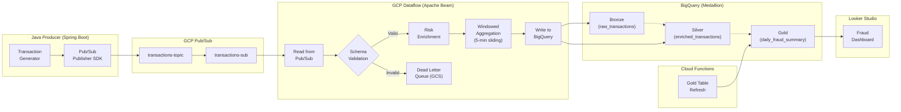
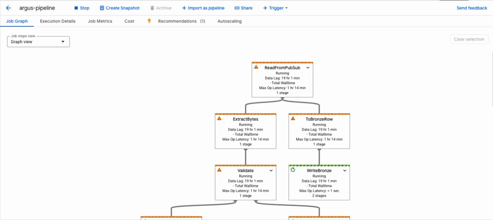
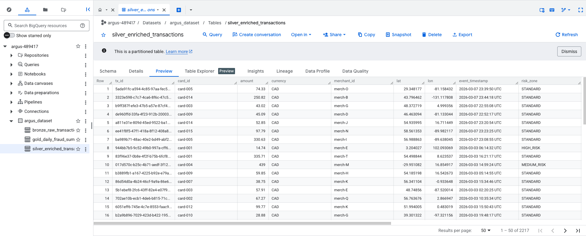
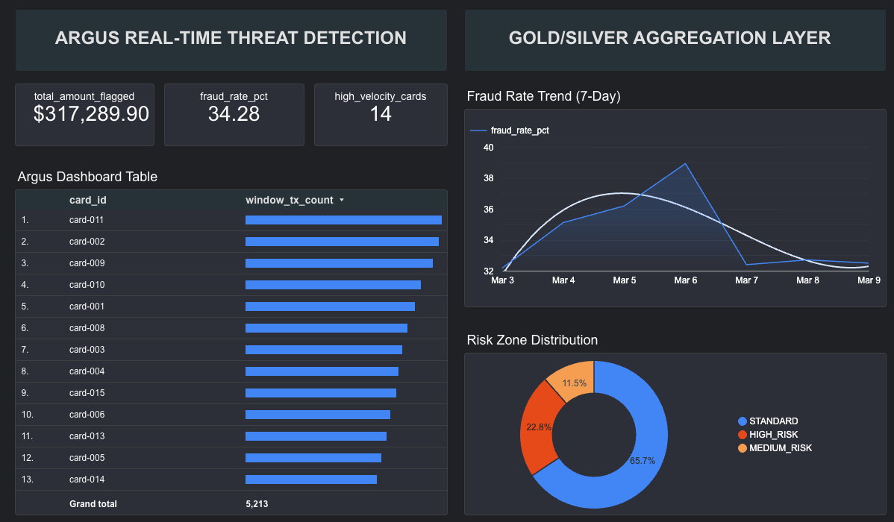

# Argus

> Real-time fraud detection platform that ingests financial transactions, enriches them with geo-spatial risk scoring, and detects high-velocity card attacks- all on Google Cloud.

      

Argus is a production-grade streaming pipeline built on **GCP Dataflow** that validates, enriches, and windows financial transactions through Apache Beam, landing results in a cost-optimized BigQuery data warehouse following a **Bronze → Silver → Gold** Medallion Architecture. All infrastructure is provisioned via Terraform.

---

## Table of Contents

- [Argus](#argus)
  - [Table of Contents](#table-of-contents)
  - [Architecture](#architecture)
  - [Why GCP?](#why-gcp)
  - [Medallion Architecture](#medallion-architecture)
  - [Engineering Decisions](#engineering-decisions)
    - [1. Sliding Windows Solve the Boundary Problem](#1-sliding-windows-solve-the-boundary-problem)
    - [2. Dead Letter Queues Guarantee Pipeline Continuity](#2-dead-letter-queues-guarantee-pipeline-continuity)
    - [3. Idempotent Gold Materialization via MERGE](#3-idempotent-gold-materialization-via-merge)
    - [4. Geo-Fence Risk Enrichment](#4-geo-fence-risk-enrichment)
    - [5. Exactly-Once Semantics Across the Pipeline](#5-exactly-once-semantics-across-the-pipeline)
  - [Infrastructure as Code](#infrastructure-as-code)
  - [Deployment](#deployment)
    - [Provision \> Launch \> Teardown](#provision--launch--teardown)
  - [Testing](#testing)
  - [Repository Structure](#repository-structure)

---

## Architecture





---

## Why GCP?

| Decision | Alternative Considered | Rationale |
|---|---|---|
| **Dataflow** (managed Beam) | Spark on Dataproc | Fully serverless. No cluster provisioning, patching, or idle costs. Native Pub/Sub connector with exactly-once semantics out of the box |
| **Pub/Sub** | Kafka | Message bus with `enable_exactly_once_delivery`, 7-day retention, and native Dataflow integration. Eliminates broker management, ZooKeeper coordination, and partition rebalancing overhead. |
| **BigQuery** | Redshift / Snowflake | Serverless, columnar, and supports partition pruning + cluster pruning natively. On-demand pricing means zero cost at rest. `require_partition_filter = true` prevents accidental full-table scans at the schema level. |
| **Cloud Functions** | Cloud Composer (Airflow) | A single daily `MERGE` upsert does not justify an always-on GKE cluster. Cloud Functions costs $0 at this volume. |
| **Region: `northamerica-northeast2`** | `us-central1` | Toronto region is lowest latency for Canadian banking workloads, data residency compliance, and competitive GCP pricing. |

---

## Medallion Architecture

The data warehouse follows a three-layer Medallion pattern to separate concerns between **audit**, **analytics**, and **business reporting**.

| Layer | Table | Purpose | Storage Strategy |
|---|---|---|---|
| **Bronze** | `bronze_raw_transactions` | Immutable audit log that keeps raw JSON preserved byte-for-byte as received from Pub/Sub | Partitioned by `publish_date`, clustered by `ingestion_id` |
| **Silver** | `silver_enriched_transactions` | Validated, flattened, and enriched with `risk_zone`, `risk_score`, and `window_tx_count` | Partitioned by `event_date`, clustered by `card_id, risk_zone` |
| **Gold** | `gold_daily_fraud_summary` | Pre-aggregated business metrics — fraud rate, flagged amounts, high-velocity card counts | Partitioned by `summary_date` |

**Why this matters:** Bronze enables full reprocessability without replaying Pub/Sub. Silver's clustering makes per-card lookups hit only relevant data blocks. Gold reduces dashboard query costs by ~95%. One pre-computed row per day vs. scanning all enriched records constantly.



---

## Engineering Decisions

### 1. Sliding Windows Solve the Boundary Problem

**Context.** Fixed-window aggregation (e.g., 5-minute tumbling windows) creates blind spots. A burst of 10 fraudulent transactions spanning a window boundary (e.g. minute `4:58` to `5:02`) splits into two groups of 5, each appearing benign. The attack goes undetected.

**Decision.** Sliding windows with a 5-minute duration and 1-minute slide period. Every 60 seconds, the system re-evaluates the last 5 minutes of per-card activity. Any `card_id` exceeding 5 transactions within a single window is flagged as `high_velocity`. This eliminates boundary blind spots entirely.

**Trade-off.** Sliding windows produce ~5× more window panes than fixed windows (each event belongs to 5 overlapping windows). The compute overhead is acceptable at current throughput and is offset by the hard cap of 2 Dataflow workers.

### 2. Dead Letter Queues Guarantee Pipeline Continuity

**Context.** In financial data pipelines, a single malformed record — missing `card_id`, out-of-range coordinates, corrupt JSON — cannot be allowed to halt stream processing.

**Decision.** The `ValidateTransaction` DoFn applies an 8-field schema gate before any enrichment occurs. Beam's `TaggedOutput` forks the pipeline: valid records proceed downstream, invalid records are routed to a GCS-based Dead Letter Queue with full error metadata (`error_type`, `error_message`, `original_payload`). The DLQ path is partitioned by `year/month/day/hour` for targeted forensic investigation.

```
ValidateTransaction DoFn
├── TaggedOutput('valid')       → Enrichment → BigQuery
└── TaggedOutput('dead_letter') → GCS (gs://argus-dlq/year=.../batch.jsonl)
```

**Result.** The pipeline maintains 100% uptime regardless of upstream data quality. Malformed records are preserved, queryable, and available for root-cause analysis without re-running the pipeline.

### 3. Idempotent Gold Materialization via MERGE

**Context.** The Gold layer must be refreshed daily without creating duplicates if the job runs more than once.

**Decision.** A Python Cloud Function executes a BigQuery `MERGE` (upsert) keyed on `summary_date`. If the row exists, it updates; if not, it inserts. This makes the refresh fully idempotent — safe to retry, safe to re-run.

### 4. Geo-Fence Risk Enrichment

**Context.** Transactions originating from high-risk geographic regions require elevated scoring.

**Decision.** The `EnrichWithRiskZone` DoFn evaluates each transaction's `(lat, lon)` against pre-defined bounding boxes. Matches are assigned a `risk_zone` (`HIGH_RISK`, `MEDIUM_RISK`, `STANDARD`) and a composite `risk_score` (0–100) combining the zone's base score with an amount-based modifier.

### 5. Exactly-Once Semantics Across the Pipeline

**Context.** Financial transaction data has zero tolerance for duplicates or data loss.

**Decision.** Pub/Sub is configured with `enable_exactly_once_delivery = true` and 7-day message retention for replay capability. At the BigQuery write layer, `pubsub_message_id` serves as a deduplication key. This belt-and-suspenders approach guarantees idempotency from ingestion through storage.



---

## Infrastructure as Code

All GCP resources are provisioned via Terraform in a flat, single-folder layout with remote GCS state backend. Service accounts follow least-privilege IAM — each binding is scoped to exactly the permissions required.

```
terraform/
├── main.tf          # Provider, backend, ALL resource definitions
├── variables.tf     # project_id, region, environment
├── outputs.tf       # Topic ID, dataset ID, bucket names
└── schemas/         # BigQuery table schema JSON (bronze, silver, gold)
```

| Resource | Key Configuration |
|---|---|
| Pub/Sub Topic + Subscription | Exactly-once delivery, 60s ack deadline, 7-day retention |
| BigQuery Dataset + 3 Tables | Day-partitioned, clustered, `require_partition_filter = true`, deletion-protected |
| GCS Buckets (DLQ + Staging) | Lifecycle policies — 30-day (DLQ) / 7-day (staging) auto-delete |
| Service Account + IAM | Least-privilege bindings: `dataflow.worker`, `bigquery.dataEditor`, `pubsub.subscriber`, `storage.objectAdmin` |

---

## Deployment

All deployments run from the local terminal.

### Provision > Launch > Teardown

```bash
# Infra
cd terraform/
terraform init && terraform apply -var="project_id=YOUR_PROJECT_ID"

# Beam Pipeline
pip install -r requirements.txt
python argus_beam/pipeline.py \
  --runner=DataflowRunner \
  --project=YOUR_PROJECT_ID \
  --region=northamerica-northeast2 \
  --temp_location=gs://YOUR_PROJECT_ID-argus-dataflow/temp \
  --staging_location=gs://YOUR_PROJECT_ID-argus-dataflow/staging \
  --streaming --max_num_workers=2 --machine_type=n1-standard-1

# Java Producer
cd producer/argus-producer && ./mvnw spring-boot:run

# Teardown
gcloud dataflow jobs cancel JOB_ID --region=northamerica-northeast2
cd terraform/ && terraform destroy -var="project_id=YOUR_PROJECT_ID"
```

---

## Testing

44 unit and integration tests validating schema enforcement, geo-fence accuracy, velocity windowing, and end-to-end pipeline correctness.

```bash
pytest tests/ -v
```

---

## Repository Structure

```
argus/
├── producer/                      # Java Spring Boot — transaction generator + Pub/Sub publisher
│   └── argus-producer/
├── argus_beam/                    # Python Apache Beam streaming pipeline
│   ├── pipeline.py                # Pipeline entry point
│   ├── transforms/                # ValidateTransaction · EnrichWithRiskZone · ComputeVelocity
├── functions/                     # Cloud Function — Gold table MERGE refresh
│   └── gold_refresh/
├── terraform/                     # 100% IaC — Pub/Sub, BigQuery, GCS, IAM
│   ├── main.tf
│   ├── variables.tf / outputs.tf
│   └── schemas/                   # BigQuery table schema JSON
├── tests/                         # 44 pytest unit + integration tests
├── docs/images/                   # Architecture diagrams and screenshots
├── requirements.txt
```

---

Built with ❤️ by [Omrahn Faqiri](https://omrahnfaqiri.com/)