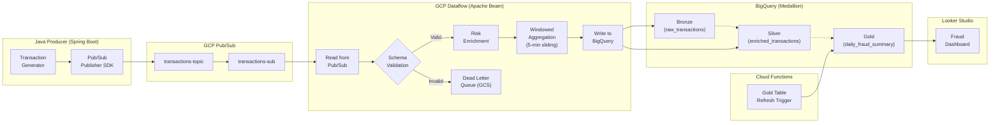
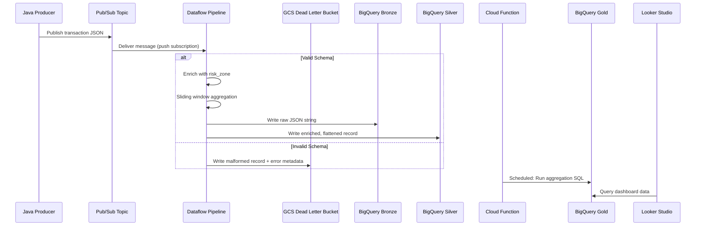
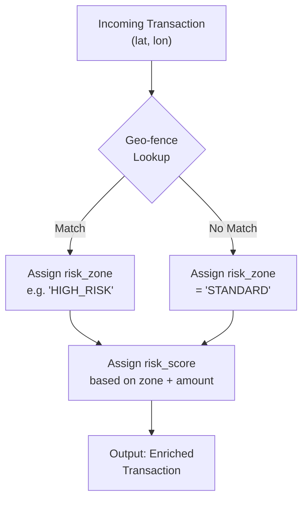
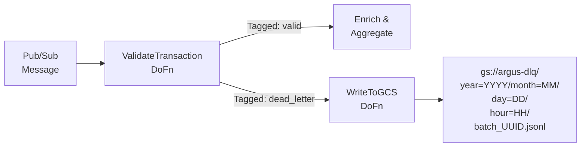
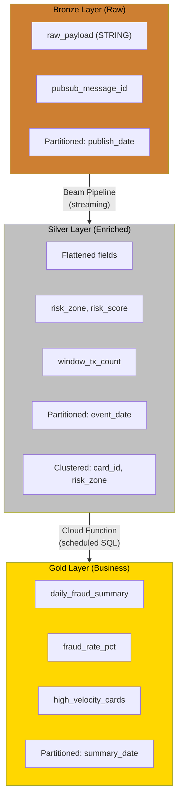

# Project Argus — The Definitive Blueprint

> **"Argus Panoptes"** — The all-seeing watchman of Greek mythology.
> This system is the all-seeing watchman over financial transaction streams.

---

## Table of Contents

1. [Mission Statement](#1-mission-statement)
2. [System Architecture](#2-system-architecture)
3. [Schema Definitions](#3-schema-definitions)
4. [Data Reliability](#4-data-reliability)
5. [Medallion Architecture (BigQuery)](#5-medallion-architecture-bigquery)
6. [Apache Beam Pipeline Deep-Dive](#6-apache-beam-pipeline-deep-dive)
7. [Infrastructure as Code (Terraform)](#7-infrastructure-as-code-terraform)
8. [Manual Deployment (CLI)](#8-manual-deployment-cli)
9. [Cost Guardrails](#9-cost-guardrails)
10. [Development Workflow](#10-development-workflow)
11. [Repository Structure](#11-repository-structure)
12. [Interview Talking Points](#12-interview-talking-points)
13. [Glossary](#13-glossary)

---

## 1. Mission Statement

**Argus** is a cloud-native, real-time financial transaction monitoring and risk-enrichment pipeline built entirely on **Google Cloud Platform**. It ingests high-throughput transaction streams from a Java-based producer, validates and enriches each record through a streaming Apache Beam pipeline (Dataflow), and lands the results in a cost-optimized BigQuery data warehouse following a **Bronze → Silver → Gold** Medallion Architecture.

The project demonstrates mastery in:

| Competency | How Argus Proves It |
|---|---|
| **Data Reliability** | Dead Letter Queues, schema validation, exactly-once semantics |
| **Cost Efficiency** | Partitioning, clustering, worker caps, on-demand pricing |
| **Scalability** | Dataflow autoscaling (capped), Pub/Sub fan-out |
| **Infrastructure as Code** | 100% Terraform — zero console clicks, flat single-folder layout |
| **Manual Deployment** | CLI-driven `terraform apply` and `gcloud` commands from local terminal |

---

## 2. System Architecture

### 2.1 High-Level Data Flow



### 2.2 Component Interaction Diagram



### 2.3 Risk Enrichment Flow



---

## 3. Schema Definitions

### 3.1 Incoming Transaction Payload (JSON)

This is the contract between the Java Producer and Pub/Sub.

```json
{
  "$schema": "http://json-schema.org/draft-07/schema#",
  "title": "ArgusTransaction",
  "type": "object",
  "required": ["tx_id", "card_id", "amount", "currency", "merchant_id", "lat", "lon", "timestamp"],
  "properties": {
    "tx_id": {
      "type": "string",
      "format": "uuid",
      "description": "Globally unique transaction identifier"
    },
    "card_id": {
      "type": "string",
      "pattern": "^CARD-[A-Z0-9]{8}$",
      "description": "Masked card identifier"
    },
    "amount": {
      "type": "number",
      "exclusiveMinimum": 0,
      "description": "Transaction amount in the given currency"
    },
    "currency": {
      "type": "string",
      "enum": ["CAD", "USD", "EUR", "GBP"],
      "default": "CAD",
      "description": "ISO 4217 currency code"
    },
    "merchant_id": {
      "type": "string",
      "description": "Merchant where the transaction occurred"
    },
    "lat": {
      "type": "number",
      "minimum": -90,
      "maximum": 90,
      "description": "Latitude of transaction origin"
    },
    "lon": {
      "type": "number",
      "minimum": -180,
      "maximum": 180,
      "description": "Longitude of transaction origin"
    },
    "timestamp": {
      "type": "string",
      "format": "date-time",
      "description": "ISO 8601 UTC timestamp of the transaction"
    }
  },
  "additionalProperties": false
}
```

### 3.2 Dead Letter Record Schema

When validation fails, the malformed record is wrapped with error metadata and written to GCS.

```json
{
  "original_payload": "<raw JSON string — preserved exactly as received>",
  "error_type": "SCHEMA_VALIDATION_FAILURE | DESERIALIZATION_ERROR",
  "error_message": "Human-readable description of what failed",
  "pipeline_timestamp": "ISO 8601 — when the pipeline processed this record",
  "topic": "projects/{project}/topics/transactions-topic",
  "subscription": "projects/{project}/subscriptions/transactions-sub"
}
```

### 3.3 BigQuery Table Schemas

#### Bronze: `argus_dataset.bronze_raw_transactions`

Stores the raw, untouched JSON for audit and reprocessing.

```sql
CREATE TABLE IF NOT EXISTS `argus_dataset.bronze_raw_transactions` (
  ingestion_id        STRING      NOT NULL,   -- Pipeline-assigned UUID
  raw_payload         STRING      NOT NULL,   -- Original JSON string
  pubsub_message_id   STRING,                 -- Pub/Sub dedup key
  pubsub_publish_time TIMESTAMP   NOT NULL,   -- When Pub/Sub received it
  ingestion_timestamp  TIMESTAMP   NOT NULL    -- When the pipeline wrote it
)
PARTITION BY DATE(pubsub_publish_time)
CLUSTER BY ingestion_id
OPTIONS (
  description = 'Raw transaction payloads for audit lineage. Partitioned by publish date.',
  require_partition_filter = true
);
```

#### Silver: `argus_dataset.silver_enriched_transactions`

The "working" table — flattened, validated, and enriched.

```sql
CREATE TABLE IF NOT EXISTS `argus_dataset.silver_enriched_transactions` (
  tx_id               STRING      NOT NULL,
  card_id             STRING      NOT NULL,
  amount              NUMERIC     NOT NULL,
  currency            STRING      NOT NULL,
  merchant_id         STRING      NOT NULL,
  lat                 FLOAT64     NOT NULL,
  lon                 FLOAT64     NOT NULL,
  event_timestamp     TIMESTAMP   NOT NULL,   -- Original transaction time
  risk_zone           STRING      NOT NULL,   -- 'HIGH_RISK', 'MEDIUM_RISK', 'STANDARD'
  risk_score          INT64       NOT NULL,   -- 0-100 composite score
  window_tx_count     INT64,                  -- Transactions by this card in the window
  ingestion_timestamp  TIMESTAMP   NOT NULL,
  pubsub_message_id   STRING
)
PARTITION BY DATE(event_timestamp)
CLUSTER BY card_id, risk_zone
OPTIONS (
  description = 'Enriched transactions. Partitioned by event date, clustered by card and risk zone.',
  require_partition_filter = true
);
```

#### Gold: `argus_dataset.gold_daily_fraud_summary`

Aggregated business-facing table, refreshed by a scheduled Cloud Function.

```sql
CREATE TABLE IF NOT EXISTS `argus_dataset.gold_daily_fraud_summary` (
  summary_date            DATE       NOT NULL,
  total_transactions      INT64      NOT NULL,
  total_flagged           INT64      NOT NULL,   -- risk_score >= 70
  total_amount_processed  NUMERIC    NOT NULL,
  total_amount_flagged    NUMERIC    NOT NULL,
  avg_risk_score          FLOAT64    NOT NULL,
  top_risk_zone           STRING,                -- Zone with most flags
  high_velocity_cards     INT64      NOT NULL,   -- Cards with window_tx_count > 5
  fraud_rate_pct          FLOAT64    NOT NULL     -- (flagged / total) * 100
)
PARTITION BY summary_date
OPTIONS (
  description = 'Daily fraud summary for executive dashboards.'
);
```

**Gold Refresh Query** (executed by the Cloud Function):

```sql
MERGE `argus_dataset.gold_daily_fraud_summary` AS gold
USING (
  SELECT
    DATE(event_timestamp) AS summary_date,
    COUNT(*)                                                AS total_transactions,
    COUNTIF(risk_score >= 70)                               AS total_flagged,
    SUM(amount)                                             AS total_amount_processed,
    SUM(IF(risk_score >= 70, amount, 0))                    AS total_amount_flagged,
    AVG(risk_score)                                         AS avg_risk_score,
    (SELECT risk_zone
     FROM `argus_dataset.silver_enriched_transactions` s2
     WHERE DATE(s2.event_timestamp) = DATE(s.event_timestamp)
       AND s2.risk_score >= 70
     GROUP BY risk_zone
     ORDER BY COUNT(*) DESC
     LIMIT 1)                                               AS top_risk_zone,
    COUNTIF(window_tx_count > 5)                            AS high_velocity_cards,
    SAFE_DIVIDE(COUNTIF(risk_score >= 70), COUNT(*)) * 100  AS fraud_rate_pct
  FROM `argus_dataset.silver_enriched_transactions` s
  WHERE DATE(event_timestamp) = CURRENT_DATE()
  GROUP BY summary_date
) AS silver
ON gold.summary_date = silver.summary_date
WHEN MATCHED THEN UPDATE SET
  total_transactions     = silver.total_transactions,
  total_flagged          = silver.total_flagged,
  total_amount_processed = silver.total_amount_processed,
  total_amount_flagged   = silver.total_amount_flagged,
  avg_risk_score         = silver.avg_risk_score,
  top_risk_zone          = silver.top_risk_zone,
  high_velocity_cards    = silver.high_velocity_cards,
  fraud_rate_pct         = silver.fraud_rate_pct
WHEN NOT MATCHED THEN INSERT VALUES (
  silver.summary_date, silver.total_transactions, silver.total_flagged,
  silver.total_amount_processed, silver.total_amount_flagged,
  silver.avg_risk_score, silver.top_risk_zone,
  silver.high_velocity_cards, silver.fraud_rate_pct
);
```

---

## 4. Data Reliability

### 4.1 Schema Validation (Pipeline Entry Gate)

Every message entering the Beam pipeline passes through a **validation DoFn** before any processing occurs.

**Validation Rules:**

| Field | Rule | On Failure |
|---|---|---|
| `tx_id` | Must be a valid UUID v4 | → DLQ |
| `card_id` | Must match `^CARD-[A-Z0-9]{8}$` | → DLQ |
| `amount` | Must be `> 0` and `< 1_000_000` | → DLQ |
| `currency` | Must be one of `CAD, USD, EUR, GBP` | → DLQ |
| `lat` | Must be `[-90, 90]` | → DLQ |
| `lon` | Must be `[-180, 180]` | → DLQ |
| `timestamp` | Must parse as ISO 8601 | → DLQ |
| JSON parse | Must deserialize without error | → DLQ |

**Implementation Pattern (Python Beam DoFn):**

```python
class ValidateTransaction(beam.DoFn):
    """Validates incoming transaction JSON against the Argus schema.
    
    Outputs:
        'valid'   → well-formed transactions proceed to enrichment.
        'dead_letter' → malformed records are tagged and routed to GCS.
    """
    VALID = 'valid'
    DEAD_LETTER = 'dead_letter'
    CARD_PATTERN = re.compile(r'^CARD-[A-Z0-9]{8}$')
    ALLOWED_CURRENCIES = {'CAD', 'USD', 'EUR', 'GBP'}

    def process(self, element, timestamp=beam.DoFn.TimestampParam):
        try:
            record = json.loads(element.decode('utf-8'))

            # --- Field-level validation ---
            assert isinstance(record.get('tx_id'), str)
            uuid.UUID(record['tx_id'], version=4)

            assert self.CARD_PATTERN.match(record.get('card_id', ''))
            assert isinstance(record.get('amount'), (int, float))
            assert 0 < record['amount'] < 1_000_000
            assert record.get('currency') in self.ALLOWED_CURRENCIES
            assert -90 <= record.get('lat', 999) <= 90
            assert -180 <= record.get('lon', 999) <= 180

            event_ts = datetime.fromisoformat(record['timestamp'].replace('Z', '+00:00'))

            yield beam.pvalue.TaggedOutput(self.VALID, record)

        except Exception as e:
            yield beam.pvalue.TaggedOutput(self.DEAD_LETTER, {
                'original_payload': element.decode('utf-8', errors='replace'),
                'error_type': type(e).__name__,
                'error_message': str(e),
                'pipeline_timestamp': datetime.utcnow().isoformat()
            })
```

### 4.2 Dead Letter Queue (DLQ) Strategy



**DLQ Design Decisions:**

| Decision | Rationale |
|---|---|
| **Destination: GCS** (not another Pub/Sub topic) | Cheaper for storage; DLQ records are rarely reprocessed in real-time |
| **Format: JSONL** (one JSON object per line) | Easy to re-ingest with `gsutil cat \| beam` or load into BQ for analysis |
| **Partitioned path** (`year=/month=/day=/hour=`) | Enables targeted investigation ("What broke at 3 AM on Tuesday?") |
| **Includes error metadata** | Root-cause analysis without re-running the pipeline |

### 4.3 Pub/Sub Delivery Guarantees

| Setting | Value | Why |
|---|---|---|
| `ack_deadline_seconds` | `60` | Gives Dataflow time to process + write before re-delivery |
| `message_retention_duration` | `7d` | Allows replay of a full week if the pipeline goes down |
| `dead_letter_policy` (Pub/Sub native) | Disabled | We handle DLQ in-pipeline for richer error metadata |
| `enable_exactly_once_delivery` | `true` | Prevents duplicate processing (critical for financial data) |

---

## 5. Medallion Architecture (BigQuery)



**Why Medallion?**

- **Bronze** preserves the raw payload for **audit** and **reprocessability**. If the Silver schema changes, you can backfill from Bronze without re-ingesting from Pub/Sub.
- **Silver** is the analytical workhorse. Partitioning by `event_timestamp` ensures time-range queries only scan relevant partitions. Clustering by `card_id` makes per-card lookups extremely cheap.
- **Gold** is the executive layer. Pre-aggregated, refreshed daily, and designed for direct consumption by Looker Studio dashboards.

---

## 6. Apache Beam Pipeline Deep-Dive

### 6.1 Pipeline DAG

```python
# pipeline.py — Simplified structure
with beam.Pipeline(options=pipeline_options) as p:

    # 1. Read from Pub/Sub
    raw_messages = (
        p
        | 'ReadPubSub' >> beam.io.ReadFromPubSub(
              subscription='projects/{project}/subscriptions/transactions-sub',
              with_attributes=True
          )
    )

    # 2. Validate (branching output)
    validated = (
        raw_messages
        | 'Validate' >> beam.ParDo(ValidateTransaction())
              .with_outputs(ValidateTransaction.DEAD_LETTER, main=ValidateTransaction.VALID)
    )

    # 3. Dead Letter → GCS
    (
        validated[ValidateTransaction.DEAD_LETTER]
        | 'SerializeDLQ'    >> beam.Map(json.dumps)
        | 'WindowDLQ'       >> beam.WindowInto(window.FixedWindows(300))  # 5-min batches
        | 'WriteDLQ'        >> beam.io.WriteToText(
              'gs://argus-dlq/errors',
              file_name_suffix='.jsonl',
              num_shards=1
          )
    )

    # 4. Enrich valid records
    enriched = (
        validated[ValidateTransaction.VALID]
        | 'Enrich' >> beam.ParDo(EnrichWithRiskZone())
    )

    # 5. Write to Bronze (raw JSON string)
    (
        raw_messages
        | 'ToBronzeRow'  >> beam.Map(format_bronze_row)
        | 'WriteBronze'  >> beam.io.WriteToBigQuery(
              'argus_dataset.bronze_raw_transactions',
              write_disposition=beam.io.BigQueryDisposition.WRITE_APPEND,
              insert_retry_strategy=beam.io.gcp.bigquery_tools.RetryStrategy.RETRY_ON_TRANSIENT_ERROR
          )
    )

    # 6. Sliding window aggregation (velocity detection)
    windowed = (
        enriched
        | 'AddCardKey'      >> beam.Map(lambda r: (r['card_id'], r))
        | 'Window5Min'      >> beam.WindowInto(
              window.SlidingWindows(size=300, period=60)  # 5-min window, 1-min slide
          )
        | 'GroupByCard'     >> beam.GroupByKey()
        | 'ComputeVelocity' >> beam.ParDo(ComputeVelocity())
    )

    # 7. Write to Silver
    (
        windowed
        | 'ToSilverRow'  >> beam.Map(format_silver_row)
        | 'WriteSilver'  >> beam.io.WriteToBigQuery(
              'argus_dataset.silver_enriched_transactions',
              write_disposition=beam.io.BigQueryDisposition.WRITE_APPEND,
              insert_retry_strategy=beam.io.gcp.bigquery_tools.RetryStrategy.RETRY_ON_TRANSIENT_ERROR
          )
    )
```

### 6.2 Key DoFns

#### `EnrichWithRiskZone`

```python
class EnrichWithRiskZone(beam.DoFn):
    """Maps (lat, lon) to a pre-defined risk zone and computes a composite risk score."""

    # Geo-fenced risk zones (lat_min, lat_max, lon_min, lon_max) -> zone
    RISK_ZONES = [
        {'name': 'HIGH_RISK',   'lat': (1.0, 10.0),   'lon': (100.0, 115.0), 'base_score': 80},
        {'name': 'HIGH_RISK',   'lat': (5.0, 15.0),   'lon': (30.0, 50.0),   'base_score': 75},
        {'name': 'MEDIUM_RISK', 'lat': (35.0, 45.0),  'lon': (25.0, 45.0),   'base_score': 50},
        {'name': 'MEDIUM_RISK', 'lat': (-35.0, -20.0),'lon': (15.0, 35.0),   'base_score': 45},
    ]
    DEFAULT_ZONE = {'name': 'STANDARD', 'base_score': 10}

    def process(self, record):
        lat, lon = record['lat'], record['lon']
        zone = self.DEFAULT_ZONE

        for rz in self.RISK_ZONES:
            if (rz['lat'][0] <= lat <= rz['lat'][1] and
                rz['lon'][0] <= lon <= rz['lon'][1]):
                zone = rz
                break

        # Composite score: base + amount factor
        amount_factor = min(int(record['amount'] / 500) * 5, 20)  # +5 per $500, max +20
        risk_score = min(zone['base_score'] + amount_factor, 100)

        record['risk_zone'] = zone['name']
        record['risk_score'] = risk_score
        yield record
```

#### `ComputeVelocity`

```python
class ComputeVelocity(beam.DoFn):
    """For each (card_id, window), counts how many transactions occurred.
    
    A card with > 5 transactions in a 5-minute window is flagged as 'high velocity'.
    """
    def process(self, element):
        card_id, transactions = element
        tx_list = list(transactions)
        tx_count = len(tx_list)

        for tx in tx_list:
            tx['window_tx_count'] = tx_count
            yield tx
```

### 6.3 Pipeline Options

```python
pipeline_options = PipelineOptions([
    f'--project={PROJECT_ID}',
    '--runner=DataflowRunner',        # Use DirectRunner for local testing
    f'--temp_location=gs://{BUCKET}/dataflow/temp',
    f'--staging_location=gs://{BUCKET}/dataflow/staging',
    f'--region=northamerica-northeast1',  # Toronto — lowest latency for CA banking
    '--streaming',
    '--max_num_workers=2',             # HARD CAP — prevents bill explosion
    '--disk_size_gb=30',               # Minimum viable disk
    '--machine_type=n1-standard-1',    # Cheapest viable worker
    '--save_main_session',
    f'--job_name=argus-pipeline-{int(time.time())}',
])
```

---

## 7. Infrastructure as Code (Terraform)

### 7.1 Flat Folder Layout

All infrastructure lives in a **single `terraform/` folder** with three files — no modules, no nesting. This keeps things straightforward while still being 100% IaC.

```
terraform/
├── main.tf          # Provider, backend, and ALL resource definitions
├── variables.tf     # Input variables
└── outputs.tf       # Output values
```

### 7.2 `main.tf` — Provider, Backend & All Resources

```hcl
# ──────────────────────────────────────────────
# Provider & Backend
# ──────────────────────────────────────────────

terraform {
  required_version = ">= 1.7.0"

  required_providers {
    google = {
      source  = "hashicorp/google"
      version = "~> 5.0"
    }
  }

  backend "gcs" {
    bucket = "argus-terraform-state"
    prefix = "terraform/state"
  }
}

provider "google" {
  project = var.project_id
  region  = var.region
}

# ──────────────────────────────────────────────
# Pub/Sub
# ──────────────────────────────────────────────

resource "google_pubsub_topic" "transactions" {
  name    = "transactions-topic"
  project = var.project_id

  message_retention_duration = "604800s"  # 7 days
}

resource "google_pubsub_subscription" "transactions" {
  name    = "transactions-sub"
  project = var.project_id
  topic   = google_pubsub_topic.transactions.id

  ack_deadline_seconds       = 60
  message_retention_duration = "604800s"
  retain_acked_messages      = false

  enable_exactly_once_delivery = true

  expiration_policy {
    ttl = ""  # Never expires
  }
}

# ──────────────────────────────────────────────
# BigQuery
# ──────────────────────────────────────────────

resource "google_bigquery_dataset" "argus" {
  dataset_id    = "argus_dataset"
  project       = var.project_id
  location      = var.region
  description   = "Argus financial transaction monitoring data warehouse"

  default_table_expiration_ms     = null  # Tables persist
  default_partition_expiration_ms = 7776000000  # 90-day partition expiry

  labels = {
    environment = var.environment
    project     = "argus"
  }
}

resource "google_bigquery_table" "bronze" {
  dataset_id          = google_bigquery_dataset.argus.dataset_id
  table_id            = "bronze_raw_transactions"
  project             = var.project_id
  deletion_protection = true

  time_partitioning {
    type  = "DAY"
    field = "pubsub_publish_time"
  }

  clustering = ["ingestion_id"]

  schema = file("${path.module}/schemas/bronze.json")
}

resource "google_bigquery_table" "silver" {
  dataset_id          = google_bigquery_dataset.argus.dataset_id
  table_id            = "silver_enriched_transactions"
  project             = var.project_id
  deletion_protection = true

  time_partitioning {
    type  = "DAY"
    field = "event_timestamp"
  }

  clustering = ["card_id", "risk_zone"]

  schema = file("${path.module}/schemas/silver.json")
}

resource "google_bigquery_table" "gold" {
  dataset_id          = google_bigquery_dataset.argus.dataset_id
  table_id            = "gold_daily_fraud_summary"
  project             = var.project_id
  deletion_protection = true

  time_partitioning {
    type  = "DAY"
    field = "summary_date"
  }

  schema = file("${path.module}/schemas/gold.json")
}

# ──────────────────────────────────────────────
# Cloud Storage (DLQ + Dataflow Staging)
# ──────────────────────────────────────────────

resource "google_storage_bucket" "dlq" {
  name          = "${var.project_id}-argus-dlq"
  project       = var.project_id
  location      = upper(var.region)
  storage_class = "STANDARD"
  force_destroy = true

  lifecycle_rule {
    condition {
      age = 30  # Auto-delete DLQ records after 30 days
    }
    action {
      type = "Delete"
    }
  }

  uniform_bucket_level_access = true
}

resource "google_storage_bucket" "dataflow_staging" {
  name          = "${var.project_id}-argus-dataflow"
  project       = var.project_id
  location      = upper(var.region)
  storage_class = "STANDARD"
  force_destroy = true

  lifecycle_rule {
    condition {
      age = 7
    }
    action {
      type = "Delete"
    }
  }

  uniform_bucket_level_access = true
}

# ──────────────────────────────────────────────
# IAM — Service Account for Dataflow
# ──────────────────────────────────────────────

resource "google_service_account" "dataflow_sa" {
  account_id   = "argus-dataflow-sa"
  display_name = "Argus Dataflow Service Account"
  project      = var.project_id
}

resource "google_project_iam_member" "dataflow_worker" {
  project = var.project_id
  role    = "roles/dataflow.worker"
  member  = "serviceAccount:${google_service_account.dataflow_sa.email}"
}

resource "google_project_iam_member" "bq_admin" {
  project = var.project_id
  role    = "roles/bigquery.dataEditor"
  member  = "serviceAccount:${google_service_account.dataflow_sa.email}"
}

resource "google_project_iam_member" "pubsub_subscriber" {
  project = var.project_id
  role    = "roles/pubsub.subscriber"
  member  = "serviceAccount:${google_service_account.dataflow_sa.email}"
}

resource "google_project_iam_member" "storage_admin" {
  project = var.project_id
  role    = "roles/storage.objectAdmin"
  member  = "serviceAccount:${google_service_account.dataflow_sa.email}"
}
```

### 7.3 `variables.tf`

```hcl
variable "project_id" {
  description = "GCP project ID"
  type        = string
}

variable "region" {
  description = "GCP region for all resources"
  type        = string
  default     = "northamerica-northeast1"
}

variable "environment" {
  description = "Environment label (dev, staging, prod)"
  type        = string
  default     = "dev"
}
```

### 7.4 `outputs.tf`

```hcl
output "pubsub_topic" {
  value = google_pubsub_topic.transactions.id
}

output "pubsub_subscription" {
  value = google_pubsub_subscription.transactions.id
}

output "bigquery_dataset" {
  value = google_bigquery_dataset.argus.dataset_id
}

output "dlq_bucket" {
  value = google_storage_bucket.dlq.name
}

output "dataflow_staging_bucket" {
  value = google_storage_bucket.dataflow_staging.name
}

output "dataflow_service_account" {
  value = google_service_account.dataflow_sa.email
}
```

### 7.5 Backend State

> **Note:** Create the state bucket manually once before running `terraform init`:
> ```bash
> gsutil mb -l northamerica-northeast1 gs://argus-terraform-state
> ```

---

## 8. Manual Deployment (CLI)

All deployments are run **manually from your local terminal** using `terraform` and `gcloud` commands. No CI/CD pipelines — keep it simple.

### 8.1 Prerequisites

```bash
# 1. Install required CLIs
brew install --cask google-cloud-sdk   # or download from cloud.google.com
brew install terraform

# 2. Authenticate with GCP
gcloud auth login
gcloud auth application-default login  # Required for Terraform
gcloud config set project YOUR_PROJECT_ID
```

### 8.2 Deploy Infrastructure (Terraform)

```bash
cd terraform/

# First time only — initialize backend & providers
terraform init

# Preview what will be created
terraform plan -var="project_id=YOUR_PROJECT_ID"

# Apply — creates all GCP resources
terraform apply -var="project_id=YOUR_PROJECT_ID"
```

### 8.3 Deploy Beam Pipeline (Dataflow)

```bash
# From the repo root
pip install -r requirements.txt

python beam/pipeline.py \
  --runner=DataflowRunner \
  --project=YOUR_PROJECT_ID \
  --region=northamerica-northeast1 \
  --temp_location=gs://YOUR_PROJECT_ID-argus-dataflow/temp \
  --staging_location=gs://YOUR_PROJECT_ID-argus-dataflow/staging \
  --streaming \
  --max_num_workers=2 \
  --machine_type=n1-standard-1 \
  --disk_size_gb=30
```

### 8.4 Tear Down (When Done Developing)

```bash
# 1. Cancel running Dataflow jobs first
gcloud dataflow jobs list --region=northamerica-northeast1 --status=active
gcloud dataflow jobs cancel JOB_ID --region=northamerica-northeast1

# 2. Destroy all Terraform-managed resources
cd terraform/
terraform destroy -var="project_id=YOUR_PROJECT_ID"
```

---

## 9. Cost Guardrails

### 9.1 The "Anti-Cloud-Bill" Matrix

| Service | Free Tier / Budget | Argus Config | Monthly Estimate |
|---|---|---|---|
| **Pub/Sub** | First 10 GB free | Low volume synthetic data | **$0** |
| **Dataflow** | No free tier | `max_num_workers=2`, `n1-standard-1` | **$5–15** (only when running) |
| **BigQuery** | 1 TB query / 10 GB storage free | On-demand, `require_partition_filter` | **$0–2** |
| **GCS** | 5 GB free | DLQ + staging buckets | **$0** |
| **Cloud Functions** | 2M invocations free | 1 invocation/day for Gold refresh | **$0** |
| **Total** | — | — | **$5–17** (when actively developing) |

### 9.2 Hard Rules

1. **Dataflow Workers:** `max_num_workers = 2`. Never remove this cap.
2. **Stop Streaming Jobs:** When not developing, stop the Dataflow job. Streaming jobs bill by the minute. Use this command:
   ```bash
   gcloud dataflow jobs cancel JOB_ID --region=northamerica-northeast1
   ```
3. **BigQuery:** Use **on-demand pricing** only. Never switch to flat-rate/reservations. The `require_partition_filter = true` on all tables prevents accidental full-table scans.
4. **GCS Lifecycle:** DLQ bucket auto-deletes records after 30 days. Staging bucket cleans up after 7 days.
5. **No Cloud Composer:** Composer requires a GKE cluster running 24/7 (~$300/month). Use Cloud Functions for scheduled tasks instead.
6. **Budget Alert:** Set a hard budget of **$25/month** in GCP Billing → Budgets & Alerts.
7. **Local Testing:** Always test with `DirectRunner` first. Only deploy to `DataflowRunner` when validating end-to-end.
8. **Region:** Use `northamerica-northeast1` (Toronto/Montréal). Closest to Scotiabank HQ, lowest latency, and GCP has competitive pricing in this region.

### 9.3 Emergency Kill Script

```bash
#!/bin/bash
# scripts/kill_all.sh — Emergency cost containment
set -euo pipefail

PROJECT_ID=$(gcloud config get-value project)
REGION="northamerica-northeast1"

echo "🛑 Cancelling all Dataflow jobs..."
for job_id in $(gcloud dataflow jobs list --region=$REGION --status=active --format="value(id)"); do
  gcloud dataflow jobs cancel "$job_id" --region=$REGION
  echo "  Cancelled: $job_id"
done

echo "✅ All streaming jobs stopped."
echo "💡 Pub/Sub and BigQuery have no running costs when idle."
```

---

## 10. Development Workflow

### Phase 1: Foundation (Week 1)

- [ ] Initialize Git repo, create this blueprint
- [ ] Write Terraform config (`main.tf`, `variables.tf`, `outputs.tf`)
- [ ] Apply Terraform to create cloud resources from local CLI
- [ ] Push to GitHub

### Phase 2: Pipeline (Week 2)

- [ ] Write `ValidateTransaction` DoFn with unit tests
- [ ] Write `EnrichWithRiskZone` DoFn with unit tests
- [ ] Write `ComputeVelocity` DoFn with unit tests
- [ ] Assemble full pipeline, test locally with `DirectRunner`
- [ ] Deploy pipeline to Dataflow

### Phase 3: Producer (Week 3)

- [ ] Create Spring Boot app with Google Cloud Pub/Sub SDK
- [ ] Implement configurable transaction generator (rate, distribution)
- [ ] Test end-to-end: Java → Pub/Sub → Dataflow → BigQuery

### Phase 4: Polish (Week 4)

- [ ] Write Cloud Function for Gold table refresh
- [ ] Build Looker Studio dashboard
- [ ] Record Loom walkthrough video
- [ ] Write comprehensive README with architecture diagram
- [ ] Clean up, final code review, push to GitHub

---

## 11. Repository Structure

```
argus/
├── beam/
│   ├── __init__.py
│   ├── pipeline.py                 # Main Beam pipeline entry point
│   ├── transforms/
│   │   ├── __init__.py
│   │   ├── validate.py             # ValidateTransaction DoFn
│   │   ├── enrich.py               # EnrichWithRiskZone DoFn
│   │   └── velocity.py             # ComputeVelocity DoFn
│   └── utils/
│       ├── __init__.py
│       └── schemas.py              # Schema constants and helpers
├── producer/
│   ├── pom.xml                     # Maven build (Spring Boot)
│   ├── src/
│   │   └── main/java/com/argus/
│   │       ├── ArgusProducerApp.java
│   │       ├── model/Transaction.java
│   │       ├── generator/TransactionGenerator.java
│   │       └── publisher/PubSubPublisher.java
│   └── Dockerfile
├── terraform/
│   ├── main.tf                     # Provider, backend, and ALL resources
│   ├── variables.tf                # Input variables
│   ├── outputs.tf                  # Output values
│   └── schemas/                    # BigQuery table schemas
│       ├── bronze.json
│       ├── silver.json
│       └── gold.json
├── functions/
│   └── gold_refresh/
│       ├── main.py                 # Cloud Function entry point
│       └── requirements.txt
├── scripts/
│   ├── kill_all.sh                 # Emergency cost containment
│   └── local_test.sh              # Run pipeline with DirectRunner
├── tests/
│   ├── __init__.py
│   ├── test_validate.py
│   ├── test_enrich.py
│   ├── test_velocity.py
│   └── test_pipeline_integration.py
├── dashboards/
│   └── looker_studio_config.md     # Dashboard setup instructions
├── docs/
│   └── architecture.md             # Additional architecture docs
├── project-overview.md             # THIS FILE — the Source of Truth
├── requirements.txt                # Python production dependencies
├── requirements-dev.txt            # Python dev/test dependencies
├── .gitignore
├── LICENSE
└── README.md
```

---

## 12. Talking Points

### Flex 1: "I chose Pub/Sub with exactly-once delivery because financial transactions cannot tolerate duplicates."

> **Deep Dive:** "Pub/Sub's `enable_exactly_once_delivery` uses a flow-control mechanism where each message gets a unique server-assigned ID. My Dataflow pipeline deduplicates based on this ID and the `tx_id` field — a belt-and-suspenders approach. If I had to scale this further, I'd add an idempotency key at the BigQuery write layer using a `MERGE` statement to prevent duplicate inserts even under Dataflow retry scenarios."

### Flex 2: "My DLQ isn't just a dump — it's a structured, queryable audit trail."

> **Deep Dive:** "Every rejected record gets wrapped with error metadata — the exact validation rule that failed, the pipeline timestamp, and the source subscription. I partition the DLQ bucket by `year/month/day/hour` so incident response can narrow down exactly when bad data entered the system. In a production environment, I'd add a Cloud Monitoring alert on DLQ write rate — if it spikes above 5% of total throughput, it triggers a PagerDuty incident because it likely indicates an upstream schema change."

### Flex 3: "I use a Medallion Architecture in BigQuery because raw data retention is non-negotiable in banking."

> **Deep Dive:** "Bronze stores the original JSON string — byte-for-byte what Pub/Sub delivered. If my enrichment logic has a bug, I can reprocess from Bronze without touching the producer or Pub/Sub replay. Silver is partitioned by `event_timestamp` and clustered by `card_id, risk_zone` — this means a query like 'show me all high-risk transactions for card X in the last 7 days' scans at most 7 partitions and benefits from cluster pruning-which directly reduces BigQuery cost since we're on on-demand pricing."

### Flex 4: "I designed the pipeline with cost-consciousness as a first-class requirement."

> **Deep Dive:** "In a student project, it's easy to spin up expensive infrastructure. I capped Dataflow at 2 workers on `n1-standard-1` machines, I force `require_partition_filter` on every BigQuery table to prevent accidental full-table scans, and I use Cloud Functions instead of Cloud Composer to avoid the $300/month GKE overhead. My GCS buckets have lifecycle policies that auto-delete staging files after 7 days and DLQ records after 30 days. The entire system costs under $15/month during active development and $0 when idle."

### Flex 5: "My infrastructure is 100% Terraform — reproducible, auditable, and deployable in minutes."

> **Deep Dive:** "Every GCP resource — Pub/Sub topics, BigQuery datasets, GCS buckets, IAM bindings — is declared in a flat Terraform configuration with all resources in a single `main.tf`. State is stored remotely in a GCS backend for safety. I deploy from my local CLI with `terraform plan` to preview and `terraform apply` to provision — this means I can tear down and recreate the entire environment in under 5 minutes. In a production setting, I'd layer CI/CD on top (e.g., GitHub Actions running `plan` on PRs and `apply` on merge to `main`), but the IaC foundation is production-ready as-is."

---

## 13. Glossary

| Term | Definition |
|---|---|
| **Medallion Architecture** | A data design pattern with Bronze (raw), Silver (cleaned/enriched), and Gold (aggregated) layers |
| **DLQ (Dead Letter Queue)** | A destination for messages that fail processing, preserving them for later analysis |
| **Exactly-Once Delivery** | A messaging guarantee that each message is delivered and processed exactly one time |
| **Sliding Window** | A time-based aggregation window that overlaps — e.g., a 5-min window that slides every 1 minute |
| **Partition Pruning** | BigQuery optimization where only relevant date partitions are scanned |
| **Cluster Pruning** | BigQuery optimization where data blocks are skipped based on clustered column values |
| **Side Input** | A Beam concept for providing auxiliary data (like lookup tables) to a DoFn |
| **DoFn** | "Do Function" — the fundamental unit of processing in Apache Beam |
| **DirectRunner** | Beam's local runner for testing without deploying to Dataflow |
| **DataflowRunner** | Beam's GCP-managed runner that executes pipelines on Dataflow workers |
| **IaC (Infrastructure as Code)** | Managing infrastructure through declarative config files rather than manual UI |
| **JSONL** | JSON Lines — one JSON object per line, ideal for streaming and batch processing |

---

> **Last Updated:** 2026-03-05
>
> **Author:** Imrahn
>
> **Status:** 📐 Blueprint Phase — Pre-Implementation
